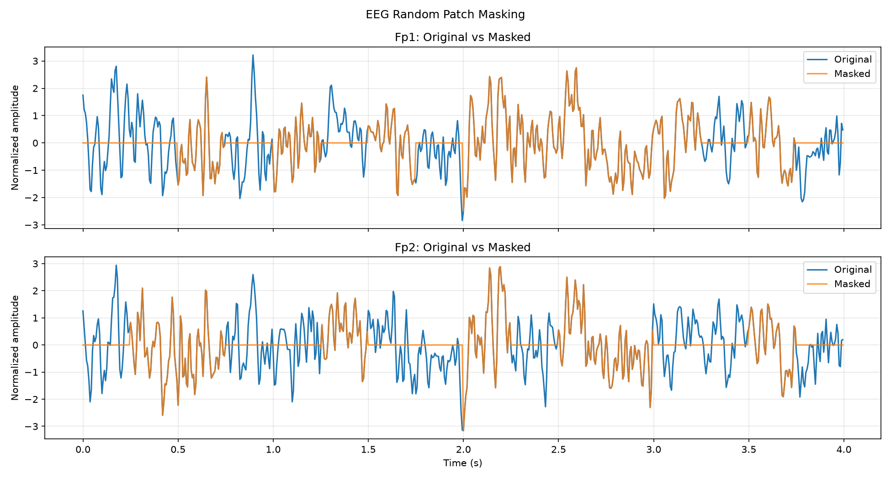
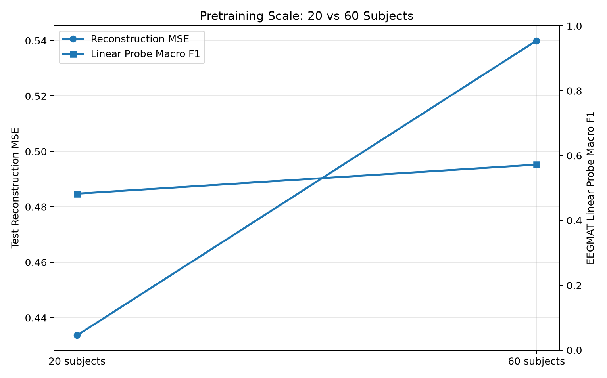
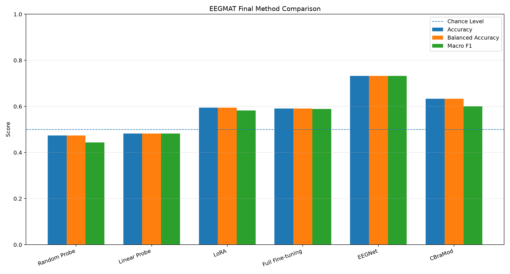
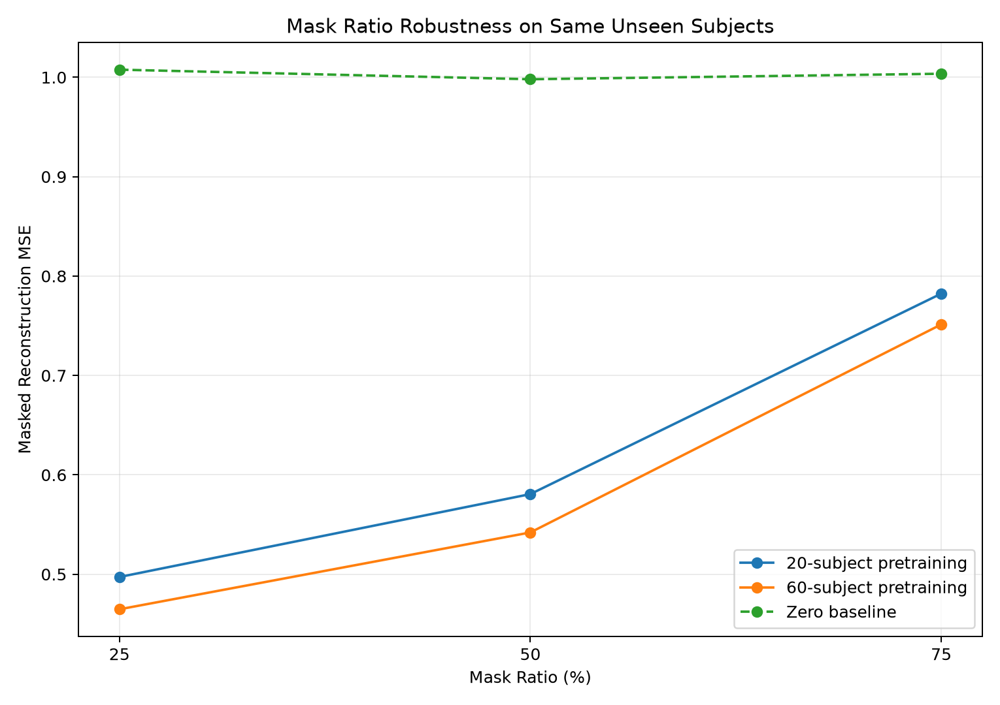
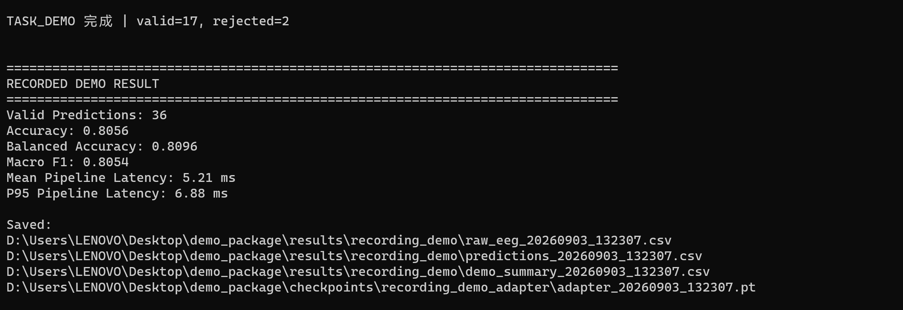

# Two-Channel EEG Foundation Model for Real-Time Cognitive Load Decoding

> Self-supervised EEG pretraining, scaling analysis, downstream transfer, and real-time LoongBrain deployment using only frontal Fp1/Fp2 channels.

**Project period:** Aug 2026 – Sep 2026  
**Institution:** Zhejiang University  
**Status:** Research prototype / course research project  
**Repository:** [eeg-foundation-model](https://github.com/yerbery-cloud/eeg-foundation-model)

---

## Overview

This project explores a lightweight **EEG foundation-model-style pipeline** for two-channel frontal EEG.

Instead of directly training a REST-vs-TASK classifier from scratch, the project first performs **self-supervised pretraining** on unlabeled EEG using **patch-based masked reconstruction**. The pretrained Transformer encoder is then transferred to a downstream **REST vs. mental-arithmetic cognitive-load classification** task and evaluated with several adaptation strategies.

The complete pipeline includes:

1. **Self-supervised EEG pretraining**
2. **20-subject → 60-subject scaling**
3. **Linear Probe / LoRA / Full Fine-tuning**
4. **Comparison with EEGNet and CBraMod**
5. **Real-time LoongBrain deployment through LSL**
6. **Independent cross-session testing**
7. **Same-session subject-specific calibration and real-time demo**

This is not intended to claim a universally generalizable BCI system. The project is designed to study what works, what transfers, and where a two-channel EEG foundation-model pipeline breaks down in real-device deployment.

---

## 中文简介

本项目围绕 **Fp1/Fp2 双通道 EEG**，完成了从 **无标签自监督预训练 → Scaling → 下游迁移 → 模型对照 → LoongBrain 真机实时部署** 的完整研究流程。

预训练阶段使用 EEGMMIDB，通过 **50% Masked Reconstruction** 训练 Transformer Encoder；下游阶段在 EEGMAT 的静息 / 心算二分类任务上比较 Linear Probe、LoRA、Full Fine-tuning，并加入 EEGNet 与开源 EEG Foundation Model CBraMod 作为对照。最后将模型接入 LoongBrain 的 LSL 实时 EEG 流，完成在线预处理、滑动窗口推理、个体校准和录屏 Demo。

严格跨-session测试表明真实 EEG 存在明显 domain shift，而在同一佩戴 session 内进行短时个体校准后，Demo Accuracy 达到 **80.56%**。该结果仅代表 **same-session subject-specific calibrated demo**，不等价于跨-session泛化性能。

---

# What I Built

- A **self-supervised EEG pretraining pipeline** based on patch masking and waveform reconstruction.
- A lightweight **4-layer Transformer encoder** for 4-second Fp1/Fp2 EEG windows.
- A **20-subject vs. 60-subject scaling study** under the same test subjects and same masking conditions.
- Downstream transfer experiments using:
  - Linear Probe
  - Random Probe
  - LoRA
  - Full Fine-tuning
  - EEGNet
  - CBraMod
- A **real-time LoongBrain pipeline** including:
  - LSL stream discovery
  - online filtering
  - resampling
  - artifact quality control
  - rolling-window inference
  - latency measurement
- A **Personal Head** for lightweight subject-specific adaptation.
- A final **same-session calibrated recording demo** using block-level cross-validation and automatic lightweight adapter selection.

---

# Method

## 1. Input and preprocessing

All models are aligned to the final LoongBrain deployment setting:

- Channels: **Fp1 / Fp2**
- Window length: **4 s**
- Target sampling rate: **160 Hz**
- Input shape: **[2, 640]**
- Band-pass filtering: **1–45 Hz**
- Per-window channel-wise **Z-score normalization**
- Offline stride: **2 s**
- Real-time update step: approximately **1 s**
- Subject-level train / validation / test split

Bad windows are rejected by quality control when they contain non-finite values, nearly flat signals, or large post-filter artifacts.

---

## 2. Self-supervised masked reconstruction

Each 4-second EEG window is divided into patches:

- Patch size: **40 samples**
- 16 patches per channel
- 32 patches in total
- Random mask ratio: **50%**

The Transformer receives the visible patches and learns to reconstruct the masked EEG segments.

```text
Fp1 / Fp2 EEG
      ↓
4 s window
      ↓
Patchify
      ↓
Randomly mask 50%
      ↓
Transformer Encoder
      ↓
Reconstruct masked patches
      ↓
Masked-only MSE loss
```

### Backbone

- Transformer layers: **4**
- Hidden dimension: **128**
- Attention heads: **4**
- Feed-forward dimension: **256**
- Dropout: **0.1**

The pretraining stage does **not** use REST/TASK labels.

Its purpose is to learn a reusable EEG representation before downstream adaptation.

---

## 3. Scaling study

The same architecture was pretrained with different amounts of unlabeled EEG:

- **20 subjects**
- **60 subjects**

To ensure a fair comparison, both pretrained models were evaluated on the same unseen subjects (**S055–S060**) using the same EEG windows and the same random masks.

### Scaling results

| Metric | 20-subject pretraining | 60-subject pretraining | Change |
|---|---:|---:|---:|
| Same-test reconstruction MSE | 0.5768 | 0.5386 | **-6.62%** |
| Frozen Linear Probe F1 | 0.4826 | 0.5722 | **+18.57% relative** |

The key result is that simply increasing the diversity of unlabeled subjects improved both reconstruction and downstream transfer, while keeping the model architecture fixed.

---

## 4. Downstream task

The downstream task is binary classification:

```text
REST  vs.  Mental Arithmetic TASK
```

Dataset: **EEGMAT**

The pretrained encoder is transferred using several strategies.

### Adaptation methods

**Linear Probe**  
Freeze the encoder and train only a linear classifier.

**LoRA**  
Freeze most pretrained weights and train lightweight low-rank adapters plus the classifier.

**Full Fine-tuning**  
Update nearly all model parameters on the downstream task.

**EEGNet**  
A compact task-specific EEG CNN baseline.

**CBraMod**  
An open-source pretrained EEG foundation model used as an external comparison.

---

# Main Downstream Results

| Method | Trainable Parameters | Accuracy | Balanced Accuracy | Macro F1 |
|---|---:|---:|---:|---:|
| Random Probe | 258 | 0.4741 | 0.4741 | 0.4440 |
| Linear Probe | 258 | 0.4828 | 0.4828 | 0.4826 |
| LoRA | 24,834 | 0.5948 | 0.5948 | 0.5824 |
| Full Fine-tuning | 537,986 | 0.5905 | 0.5905 | 0.5892 |
| EEGNet | 2,850 | **0.7328** | **0.7328** | **0.7326** |
| CBraMod | ~4.93M | 0.6336 | 0.6336 | 0.6003 |

### Observations

- **LoRA** used only about **4.6%** of the trainable parameters of Full Fine-tuning.
- LoRA's Macro F1 was only **0.0068** lower than Full FT.
- **EEGNet performed best** in this two-channel, small-data setting.
- Larger pretrained models did **not** automatically outperform compact task-specific models.
- This suggests that **task-model alignment can be more important than model size** when EEG channels and labeled data are limited.

---

# Mask-Ratio Robustness

To test whether the 60-subject scaling benefit was specific to the 50% training mask ratio, reconstruction was evaluated under three masking levels.

| Mask Ratio | 20-subject MSE | 60-subject MSE | Relative Improvement |
|---|---:|---:|---:|
| 25% | 0.4972 | 0.4648 | **6.53%** |
| 50% | 0.5806 | 0.5421 | **6.64%** |
| 75% | 0.7823 | 0.7513 | **3.96%** |

The 60-subject model remained better across all masking ratios.

This indicates that the scaling benefit was not limited to a single masking difficulty.

---

# Real-Time LoongBrain Deployment

The final system was deployed on a real **LoongBrain two-channel EEG device**.

```text
LoongBrain Fp1/Fp2
        ↓
LSL Stream
        ↓
4 s Rolling Buffer
        ↓
1–45 Hz Filtering
        ↓
250 Hz → 160 Hz Resampling
        ↓
Artifact QC
        ↓
Feature Extraction / Model Inference
        ↓
REST / TASK Prediction
```

The system continuously records:

- predicted state
- task probability
- signal quality
- model / pipeline latency
- raw EEG and summary metrics for local experiments

Private raw EEG recordings are **not intended for public release**.

---

# Independent Cross-Session Test

A new LoongBrain session was collected after training the Personal Head.

### Personal Head

The pretrained LoRA encoder was frozen.

For each 4-second window:

```text
EEG
 ↓
Frozen LoRA Encoder
 ↓
128-d representation
 ↓
Fisher-score feature selection
 ↓
Personal Linear Head
 ↓
REST / TASK
```

The selected configuration used:

- Top-K encoder features: **16**
- Linear classifier parameters: **258**
- Block-wise calibration CV before final fitting

### Independent test results

| Model | Accuracy | Balanced Accuracy | Macro F1 |
|---|---:|---:|---:|
| Source LoRA | 0.4211 | 0.4138 | 0.2963 |
| Personal Head | 0.4211 | 0.4230 | 0.4146 |

Pipeline performance:

- Mean latency: **7.24 ms**
- P95 latency: **9.71 ms**

This experiment showed that the engineering pipeline worked reliably, but **cross-session generalization remained difficult**.

The main issue was strong EEG **domain shift / non-stationarity** across device state, subject state, electrode contact, and recording session.

---

# Same-Session Calibrated Recording Demo

To improve practical same-session usability, a final subject-specific demo was designed.

## Calibration

The subject remained on the same device and in the same wearing state.

Calibration consisted of three REST/TASK pairs.

```text
REST_1 / TASK_1
REST_2 / TASK_2
REST_3 / TASK_3
```

A leave-one-pair-out block cross-validation procedure was used to select a lightweight adapter.

Two candidate feature branches were evaluated:

### Encoder branch

```text
EEG
 ↓
Frozen LoRA Encoder
 ↓
128-d representation
 ↓
Personal Linear Head
```

### Spectral branch

Features included:

- relative theta power
- relative alpha power
- relative beta power
- relative low-gamma power
- spectral entropy
- Fp1/Fp2 asymmetry
- theta/alpha ratio
- beta/alpha ratio

The final probability could be expressed as:

```text
P(final) = (1 - w) * P(encoder) + w * P(spectral)
```

Candidate adapter settings were selected using **block-level Balanced Accuracy**, not the final demo labels.

In the recorded session, the automatically selected configuration used:

```text
spectral ensemble weight = 1.0
```

meaning that the calibrated spectral branch was the most stable candidate for that specific session.

---

## Recorded demo results

Calibration:

- Valid calibration windows: **79**
- Block-CV Balanced Accuracy: **75.3%**

Recorded demo:

- Valid predictions: **36**
- Accuracy: **80.56%**
- Balanced Accuracy: **80.96%**
- Macro F1: **80.54%**
- Mean pipeline latency: **5.21 ms**
- P95 pipeline latency: **6.88 ms**

> **Important:**  
> The 80.56% result is a **same-session subject-specific calibrated demo**.  
> It should not be interpreted as an independent cross-session generalization score.

The independent cross-session test remained approximately **42.1% Accuracy**.

Together, these results suggest that short subject-specific calibration can substantially improve same-session usability, while cross-session EEG domain shift remains an open problem.

---

# Key Findings

1. **Self-supervised masked reconstruction can learn transferable EEG representations without downstream labels.**
2. **Scaling unlabeled pretraining data from 20 to 60 subjects improved both reconstruction and frozen-feature downstream performance.**
3. **LoRA provides strong parameter efficiency in small-data downstream adaptation.**
4. **Compact task-specific models such as EEGNet can outperform larger pretrained models when only two EEG channels are available.**
5. **Real-device latency is not the primary bottleneck in this system.**
6. **Cross-session EEG domain shift is substantially harder than same-session calibrated decoding.**
7. **Subject-specific calibration remains important for practical two-channel EEG deployment.**

---

# Repository Structure

Recommended public repository structure:


```text
eeg-foundation-model/
│
├── README.md
├── LICENSE
├── .gitignore
├── requirements.txt
│
├── src/
│   ├── 01_download.py
│   ├── ...
│   ├── 37_loongbrain_calibrated_recording_demo.py
│   ├── eeg_dataset.py
│   ├── eeg_masking.py
│   ├── eeg_patch_embedding.py
│   └── masked_eeg_model.py
│
├── figures/
│   ├── masking_example.png
│   ├── raw_vs_filtered.png
│   ├── pretrain_loss_curve.png
│   ├── reconstruction_example.png
│   ├── scaling_20_vs_60.png
│   ├── downstream_comparison.png
│   ├── mask_ratio_robustness.png
│   └── loongbrain_demo.png
│
├── results/
│   ├── README.md
│   ├── demo_summary.csv
│   ├── scaling_summary.csv
│   ├── linear_probe60_summary.csv
│   ├── mask_ratio_robustness_summary.csv
│   ├── pretrain20_summary.csv
│   ├── pretrain60_summary.csv
│   └── realtime_simulation_summary.csv
│
├── data/
│   └── README.md
│
└── checkpoints/
    └── README.md
```

The current numbered scripts are intentionally kept close to the original experiment workflow for reproducibility.

A future refactor may reorganize them into `data/`, `models/`, `pretrain/`, `downstream/`, `evaluation/`, and `realtime/` modules.

---

# Installation

Python 3 is recommended.

```bash
git clone <YOUR_GITHUB_REPOSITORY_URL>
cd eeg-foundation-model

python -m venv .venv
```

Windows:

```bash
.venv\Scripts\activate
```

Linux / macOS:

```bash
source .venv/bin/activate
```

Install dependencies:

```bash
pip install -r requirements.txt
```

---

# Data

Raw EEG data is **not included** in this repository.

The project uses:

- **EEGMMIDB / PhysioNet** for self-supervised pretraining
- **EEGMAT** for REST vs. mental-arithmetic downstream classification
- **LoongBrain Fp1/Fp2 EEG** for private real-device experiments

Recommended local layout:

```text
data/
├── raw/
└── processed/
```

Please download public datasets from their official sources and comply with their respective licenses and terms of use.

Private LoongBrain EEG and personal calibration recordings should remain local unless explicit consent and a suitable data-sharing protocol are available.

---

# Checkpoints

Large model checkpoints are intentionally excluded from Git by default.

Local experiments may contain:

```text
checkpoints/
├── pilot/
├── pretrain20/
├── pretrain60/
├── linear_probe/
├── linear_probe60/
├── lora/
├── full_finetune/
├── eegnet/
├── cbramod/
├── personal_head/
└── recording_demo_adapter/
```

If pretrained weights are released later, they can be hosted through:

- GitHub Releases
- Hugging Face
- Zenodo

and linked here.

---

# Example Entry Points

Inspect the LSL stream:

```bash
python src/29_lsl_stream_check.py
```

Train the Personal Head:

```bash
python src/34_train_personal_head.py
```

Run the independent LoongBrain final test:

```bash
python src/35_loongbrain_final_test.py
```

Run the mask-ratio robustness experiment:

```bash
python src/36_mask_ratio_robustness.py
```

Run the calibrated recording demo:

```bash
python src/37_loongbrain_calibrated_recording_demo.py
```

> Some scripts may require local dataset paths or checkpoints to be configured before running.

---

# Figures

After adding the selected public figures to `figures/`, the following sections can be enabled in the README.

```markdown









```

For the first public release, only include a small number of clear, final figures rather than all intermediate debugging screenshots.

---

# Reproducibility

For reproducible comparisons, the project emphasizes:

- fixed preprocessing
- subject-level splits
- explicit unseen-subject evaluation
- same-test scaling comparisons
- calibration / test separation
- fixed model checkpoints before independent testing
- block-level cross-validation for same-session adapter selection

The final demo labels were **not** used to select the adapter.

---

# Limitations

This project has several important limitations:

- Only **Fp1/Fp2** frontal channels are used.
- Downstream labeled data is relatively small.
- Real-device experiments contain limited subjects and sessions.
- Cross-session generalization remains weak.
- The final 80.56% demo is subject-specific and same-session calibrated.
- Results are not intended as evidence of clinical or consumer-grade BCI performance.
- More repeated sessions, subjects, devices, and statistical runs are needed for stronger conclusions.

---

# Privacy and Responsible Release

The public repository should not contain:

- raw personal EEG
- identifiable participant information
- private calibration CSV files
- local absolute filesystem paths
- restricted course material
- large public datasets redistributed without permission

Only de-identified summary statistics, public code, selected figures, and legally distributable model artifacts should be released.

---

# Future Work

Potential extensions include:

- stronger cross-session domain adaptation
- multi-session calibration
- multi-channel EEG pretraining
- larger and more diverse pretraining cohorts
- contrastive or multimodal self-supervised objectives
- more robust artifact handling
- subject-independent evaluation across repeated real-device sessions
- comparison with additional EEG foundation models

---

# Acknowledgements

This project was developed at **Zhejiang University** during Aug–Sep 2026.

The project uses public EEG datasets and open-source model implementations where applicable.  
All third-party datasets and models remain subject to their original licenses and citation requirements.

---

# License

The original code in this repository can be released under the **MIT License** if all included components are compatible with that license.

Third-party code, pretrained models, and datasets retain their original licenses.

---

## Contact

GitHub: [yerbery-cloud](https://github.com/yerbery-cloud)  
Repository: [eeg-foundation-model](https://github.com/yerbery-cloud/eeg-foundation-model)